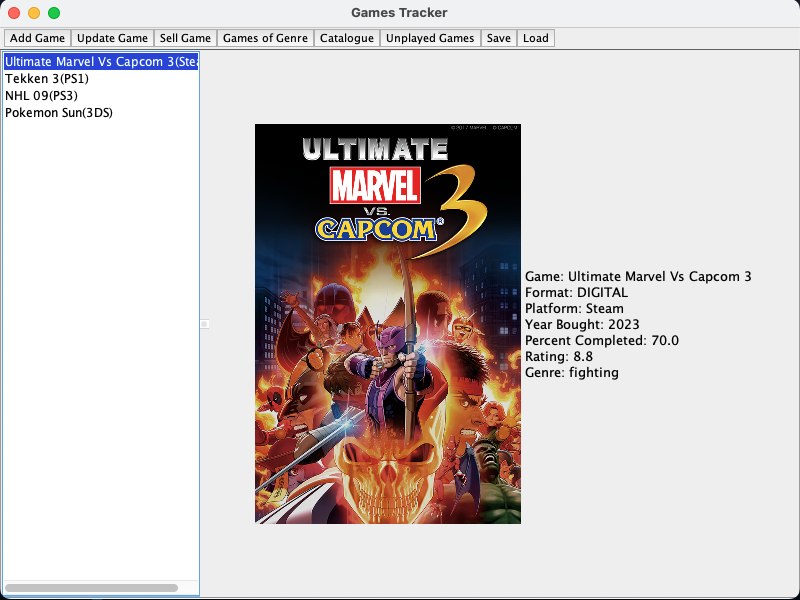
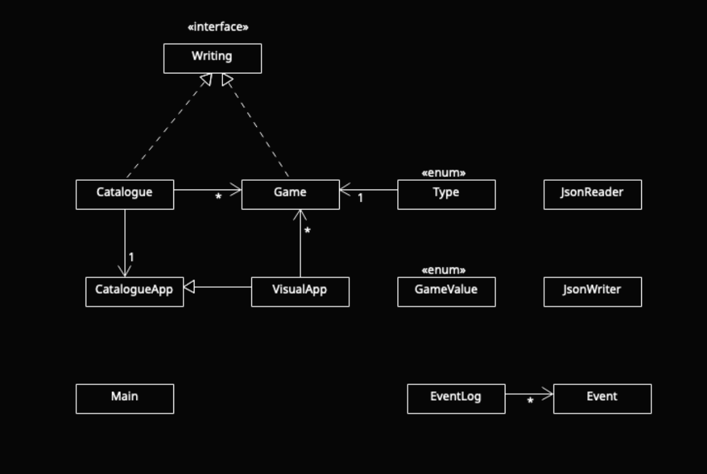

# Game Cataloguing System
This application is for cataloguing one's collection of video games.

## Who will use it?
The primary targets are users who either collect video games or have a large backlog of games that they hope to play.

## Why is this project interesting to me:
- I have a large collection of games, and many of them remain unplayed/untested
- I have a similar application on my mobile phone that I would like to improve on the concept
    - I want to show the user how much of the game they actually played, which may encourage them to try more of their games and not just buy more without experiencing the games they already have
    - It would not have to rely on a database that may or may not be aware if a game you have exists
    - Incorporate ways to search for *unplayed*/*played*/*completed* games, with a percent value
    - Be able to view the games you own for each system/platform

## User Stories
1. As a user, I want to be able to add a game to my catalogue of games, that has a specifications of `name`, `platform`, `date bought` and if the game format is `physical` or `digital`
1. As a user, I want to be able to view all the games in my catalogue
1. As a user, I want to be able to view a list of games that remain unplayed in the catalogue
1. As a user, I want to be able to change the percent completion of a game from the catalogue
1. As a user, I want to be able to remove a game, by marking it as `sold`
1. As a user, I want to be able to rate a game from the catalogue from 0 to 10, as a float
1. As a user, I want to be able to save the added and modified games to a file
1. As a user, I want to be able to load in my collection when starting the application

# Instructions for End User

- You can generate the first required action related to the user story "adding games to a catalogue of games" by pressing the `Add Game` button on the toolbar and filling in the questions asked in the dialogue
- You can generate the second required action related to the user story "viewing games in the catalogue" by pressing the `Catalogue` button; alternatively, if you wanted to view unplayed games, press the `Unplayed Games` button, and to filter by genre, press `Games of Genre` and input a genre into the dialogue
- You can locate my visual component by selecting a game on the list of games panel - when the game detail is seen on the right there will be an image representing the game art. If you have game art of the game - name it the title of the game, swapping spaces for `-`, make sure it is of png format. Otherwise, a placeholder image is used
- You can save the state of my application by pressing the `Save` button on the toolbar
- You can reload the state of my application by pressing the `Load` button on the toolbar



## Phase 4: Task 2
Representation of EventLog on console:
```
Tue Nov 26 20:07:22 PST 2024
Added Tekken 3 to the Catalogue


Tue Nov 26 20:07:47 PST 2024
Added Zubo to the Catalogue


Tue Nov 26 20:08:23 PST 2024
Added Pokemon Blue to the Catalogue


Tue Nov 26 20:08:26 PST 2024
Fetched unplayed games.


Tue Nov 26 20:08:29 PST 2024
Sold Zubo

```
## Phase 4: Task 3

If I were to refactor, I would reduce coupling, trying to remove the arrow between Visual App and Game. The only reason for this implementation was due to needing away to have a filtered list of games for the List of game panel in the gui. There is likely a work around that I would have done, have I had more time. Besides that, there are still a few ways to break the program, so I would change all the locations that require an input to have a try/catch, thus, mitigating the potential crashes in the program. For example, technically do not need to enter numbers into the dialogues that appear, but this would break it, as you would not be able to rate the game, assign a value for when this game was bought, etc.

